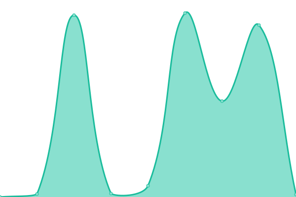

# [📈 Live Status](https://btherapy.github.io/upptime): <!--live status--> **🟧 Partial outage**

This repository contains the open-source uptime monitor and status page for [btherapy](https://btherapy.github.io/upptime), powered by [Upptime](https://github.com/upptime/upptime).

With [Upptime](https://upptime.js.org), you can get your own unlimited and free uptime monitor and status page, powered entirely by a GitHub repository. We use [Issues](https://github.com/btherapy/upptime/issues) as incident reports, [Actions](https://github.com/btherapy/upptime/actions) as uptime monitors, and [Pages](https://btherapy.github.io/upptime) for the status page.

<!--start: status pages-->
<!-- This summary is generated by Upptime (https://github.com/upptime/upptime) -->
<!-- Do not edit this manually, your changes will be overwritten -->
<!-- prettier-ignore -->
| URL | Status | History | Response Time | Uptime |
| --- | ------ | ------- | ------------- | ------ |
|  [Thera-Main](https://onboarding.therapiasoftware.com/sign_up) | 🟥 Down | [thera-main.yml](https://github.com/TapiTechSolutions/upptime/commits/HEAD/history/thera-main.yml) | 

 468ms
     
 | 

<a href="https://tapitechsolutions.github.io/upptime/history/thera-main">99.53%</a>
    

|  [Thera-Client](https://ops.therapiaclient.com/client/sign_in) | 🟥 Down | [thera-client.yml](https://github.com/TapiTechSolutions/upptime/commits/HEAD/history/thera-client.yml) | 

 4182ms
     
 | 

<a href="https://tapitechsolutions.github.io/upptime/history/thera-client">99.08%</a>
    

|  [Thera-Admin](https://therasoftware.net/admins/sign_in) | 🟩 Up | [thera-admin.yml](https://github.com/TapiTechSolutions/upptime/commits/HEAD/history/thera-admin.yml) | 

 1613ms
     
 | 

<a href="https://tapitechsolutions.github.io/upptime/history/thera-admin">99.38%</a>
    

|  [Thera-Billing](https://ops.therapiabilling.com/users/sign_in) | 🟥 Down | [thera-billing.yml](https://github.com/TapiTechSolutions/upptime/commits/HEAD/history/thera-billing.yml) | 

 8353ms
     
 | 

<a href="https://tapitechsolutions.github.io/upptime/history/thera-billing">98.87%</a>
    

|  [Thera-Support](https://ops.therapiasupport.com/en) | 🟥 Down | [thera-support.yml](https://github.com/TapiTechSolutions/upptime/commits/HEAD/history/thera-support.yml) | 

 8431ms
     
 | 

<a href="https://tapitechsolutions.github.io/upptime/history/thera-support">99.12%</a>
    

|  [Thera-Family](https://ops.therapiafamily.com/family/sign_in) | 🟩 Up | [thera-family.yml](https://github.com/TapiTechSolutions/upptime/commits/HEAD/history/thera-family.yml) | 

 8939ms
     
 | 

<a href="https://tapitechsolutions.github.io/upptime/history/thera-family">99.38%</a>
    

|  [Thera-Connect](https://ops.therapiaconnect.com/referrals/sign_in) | 🟥 Down | [thera-connect.yml](https://github.com/TapiTechSolutions/upptime/commits/HEAD/history/thera-connect.yml) | 

 9255ms
     
 | 

<a href="https://tapitechsolutions.github.io/upptime/history/thera-connect">99.31%</a>
    

|  [Thera-Telehealth](https://telehealth.therapiasoftware.com/test) | 🟩 Up | [thera-telehealth.yml](https://github.com/TapiTechSolutions/upptime/commits/HEAD/history/thera-telehealth.yml) | 

 185ms
     
 | 

<a href="https://tapitechsolutions.github.io/upptime/history/thera-telehealth">100.00%</a>
    

<!--end: status pages-->

[**Visit our status website →**](https://btherapy.github.io/upptime)

## 📄 License

- Powered by: [Upptime](https://github.com/upptime/upptime)
- Code: [MIT](./LICENSE) © [btherapy](https://btherapy.github.io/upptime)
- Data in the `./history` directory: [Open Database License](https://opendatacommons.org/licenses/odbl/1-0/)
